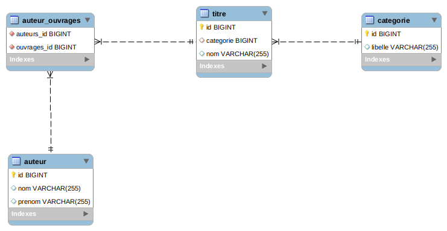

# hibernate-many-to-many

Dans ce projet, on veut représenter les données suivantes :
[data](data.csv)

On va donc implémenter quatre tables et une relation one-to-many et une relation many-to-many :

#### Spring/hibernate

On va réaliser uniquement les controllers de base du backend. Grâce à la dépéndance `org.springframework.boot:spring-boot-starter-data-rest`, les fonctions du repository seront directement exposées comme endpoints de l'application. Donc pas besoin d'écrire le controller.

On peut cependant implémenter les controllers que l'on souhaite si l'on a des besoins particuliers. Comme par exemple `AuteurController`.

#### Data

Des données d'exemple sont enregistrées en base au démarrage de l'application par la classe `DataInitializer`. Cette classe crée des entités puis les enregistre en passant par le repository. Cette approche est plus pratique en mode dev que d'utiliser des inserts dans un fichier data.sql, car si les entités sont refactorées, la classe `DataInitializer` le sera aussi.

#### Postman

On peut tester les endpoints de l'application avec la collection suivante : 

*NB : on peut convertir simplement des requetes cURL sous postman avec le bouton import*

#### Référence

La création de ce repo est faite à partir du guide officiel dans lequel on peut trouver d'autres éléments intéressants (comme l'exposition d'une requête personnalisée du repo dans le controller et son utilisation avec cURL)   
<https://spring.io/guides/gs/accessing-data-rest/>

Les relations manyToMany peuvent se frotter à de nombreuses difficultés. Je vous recommande de lire des guides de bonnes pratiques, comme celui-ci :   
<https://thoughts-on-java.org/best-practices-for-many-to-many-associations-with-hibernate-and-jpa/>

